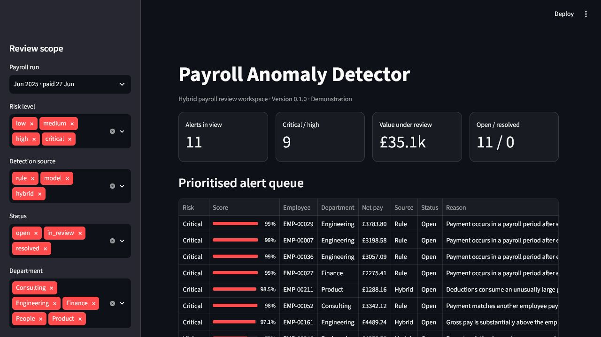
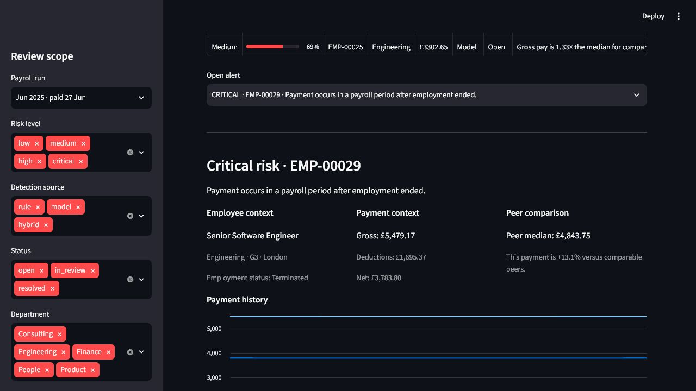

# Payroll Anomaly Detector

Finds payroll payments that look wrong, and explains why, so that a person can
check them.

Two things run side by side. A set of fixed controls catches the problems you can
define exactly: an exact duplicate of another payment, a payment dated after
someone left, a net figure higher than gross. An Isolation Forest covers the rest,
ranking payments that look unusual against the employee's own history and against
their peers, without anyone having to write down in advance what "unusual" means.

Everything in here is generated. There are no real employees, salaries, or bank
details anywhere in the project.



## Running it

Docker is the quickest route:

```powershell
docker compose up --build
```

That starts Postgres, applies the migrations, generates the dataset, trains the
model, writes the alerts, and serves the dashboard at <http://localhost:8501>.
The first build takes a few minutes.

To run it with Python 3.11 or newer instead:

```powershell
py -m venv .venv
.\.venv\Scripts\Activate.ps1
python -m pip install -e ".[dev]"
Copy-Item .env.example .env
python scripts/init_db.py
python scripts/bootstrap_demo.py
python -m streamlit run app/dashboard/main.py
```

You need a Postgres instance for this path. `docker compose up database` will give
you one on port 5433 if you do not have one already.

## Results

The default seed produces 250 employees, 18 monthly payroll runs, 4,450 payments,
and 24 injected anomalies spread across six categories.

| | Precision | Recall |
| --- | ---: | ---: |
| Fixed controls | 1.000 | 1.000 |
| Isolation Forest, at threshold | 0.191 | 0.333 |
| Isolation Forest, top 48 ranked | 0.208 | 0.417 |

The controls score perfectly because they check for the exact conditions the
generator injects. Treat that as evidence the code works, not as a performance
claim. The model scores far lower, which is what you would expect: it never sees
the labels, and it looks for unusual combinations rather than the six specific
scenarios.

The measured values live in [`reports/evaluation-metrics.json`](reports/evaluation-metrics.json)
so they are not retyped by hand into several documents. Regenerate them with
`python scripts/bootstrap_demo.py`.

## Power BI report

`Payroll Intelligence Dashboard.pbix` is a second front end over the same Postgres
tables, with four pages: Executive Overview, Case Investigation, Model Performance,
and Responsible AI. Open it in Power BI Desktop and point the connection at your
running database. `payroll-intelligence-theme.json` is the theme it uses.

The Streamlit app is the working investigation tool. The Power BI report is the
reporting view over the same data.

## How the detection works

Six controls run against every payment:

- an exact duplicate of another payment in the same run
- base pay jumping well beyond the employee's own history
- deductions taking an implausible share of gross
- the destination bank token changing days before payday
- a payment in a period after the termination date
- net pay exceeding gross pay

Anything a control fires on gets a severity and the specific evidence that
triggered it. Separately, the model scores every payment on behavioural features
built only from earlier payroll periods, so scoring a payment can never use
information from its own run or later ones. The two signals are merged into one
queue, and the dashboard shows the employee's payment history, the median for
their role and grade, the controls that fired, and which features were furthest
from normal.

An analyst records an outcome and a note. Nothing in the system changes a payment.



## Development

```powershell
python -m ruff check .
python -m ruff format --check .
python -m pytest --cov=app --cov=data_generation --cov=database
```

`scripts/verify.ps1` runs all of that plus the Docker build, which is the same set
of checks CI runs on push.

Keep logic in the relevant package rather than in the Streamlit page, and add a
test when you add a rule or a feature.

## Layout

```text
app/
  dashboard/       Streamlit interface
  detection/       Controls, model training, evaluation
  explanations/    Turns feature deviations into readable text
  features/        Feature engineering
  services/        Scoring and orchestration
data_generation/   Synthetic payroll generator
database/          SQLAlchemy models, migrations, repositories
docs/              Longer notes
reports/           Generated metrics
scripts/           Setup and one-off commands
tests/
```

The trained model lands in `models/` and is not committed. `bootstrap_demo.py`
rebuilds it.

## Notes

- [Architecture](docs/architecture.md)
- [Data and generation](docs/data.md)
- [Evaluation, limitations, and intended use](docs/evaluation.md)

## Licence

MIT. See [LICENSE](LICENSE).
