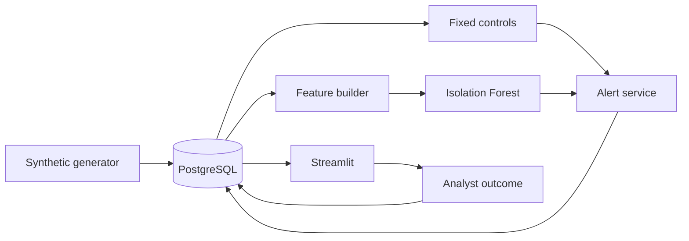

# Architecture

Everything goes through Postgres. The generator writes payroll history, the
detection code reads it and writes alerts back, and the dashboard reads both. That
means the Power BI report can sit on the same tables without any extra plumbing.

## Packages

`data_generation` builds the fictional workforce and its monthly payroll history,
then injects the six anomaly types. Injection is recorded in a separate labels
table that nothing in the detection path reads.

`database` holds the SQLAlchemy models, the Alembic migrations, session handling,
and the repositories. Eight tables: employees, bank account history, payroll runs,
payments, anomaly labels, model runs, alerts, and investigations.

`app.features` turns payments into the behavioural ratios the model uses — pay
against the employee's own history, pay against role-grade peers, deduction
shares, net-to-gross, payment counts, bank-change recency, post-termination flag,
historical volatility.

`app.detection` has the six controls in `rules.py`, Isolation Forest training and
scoring in `model.py`, and precision/recall measurement in `evaluation.py`.

`app.explanations` takes the feature vector for a flagged payment and writes the
sentence an analyst reads.

`app.services` merges control hits with model scores into a single alert queue and
persists it, along with the rule, feature, and model versions that produced it.

`app.dashboard` is the Streamlit interface. It queries and renders; the decisions
live in the packages above it.

`app.validation` reports alert and false-positive rates by department, location,
and grade.

## Avoiding leakage

Features for a payment are built only from payroll periods that closed before it.
Every payment in a run is scored before that run is appended to employee history,
so no payment can influence its own features or those of its peers in the same
run. Training and evaluation split on payroll date rather than at random. There is
a test that changes a future payment and asserts that past feature rows are
unchanged.

## Deployment

Compose runs three services. Postgres with a volume and a health check. A
bootstrap job that migrates, generates, trains, and writes alerts, then exits.
The dashboard, running as a non-root user with a health endpoint, which starts
only once bootstrap has finished successfully.

Postgres is exposed on 5433 and the dashboard on 8501. Re-running bootstrap is
safe.
